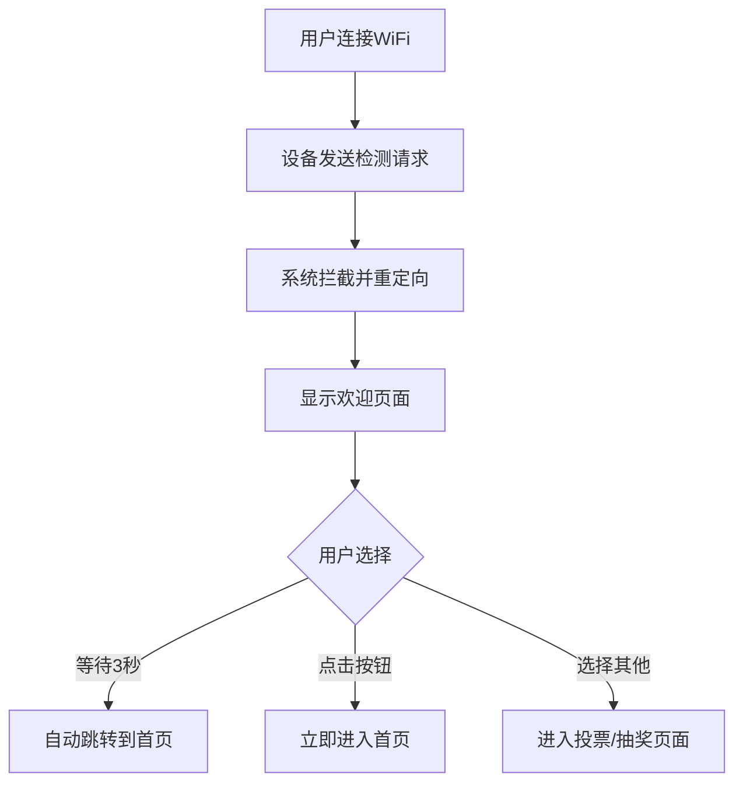

# WiFi自动弹窗功能说明

## 功能概述

当用户连接到"投票抽奖系统"WiFi热点后，会自动弹出系统首页，无需手动输入网址。这个功能称为"Captive Portal"（强制门户）。

## 工作原理

### 1. 设备连接检测
当设备连接到WiFi后，操作系统会自动发送特定的HTTP请求来检测网络连通性：

- **iOS设备**：访问 `http://captive.apple.com/hotspot-detect.html`
- **Android设备**：访问 `http://connectivitycheck.gstatic.com/generate_204`
- **Windows设备**：访问 `http://www.msftconnecttest.com/connecttest.txt`

### 2. 服务器响应
系统后端会拦截这些请求，并返回重定向响应，引导用户到欢迎页面。

### 3. 自动跳转
欢迎页面会在3秒后自动跳转到系统首页，用户可以：
- 等待自动跳转
- 点击按钮立即进入
- 选择其他功能页面

## 支持的端点

系统已配置以下Captive Portal检测端点：

| 端点 | 系统 | 说明 |
|------|------|------|
| `/generate_204` | Android | Android系统检测 |
| `/gen_204` | Chrome | Chrome浏览器检测 |
| `/hotspot-detect.html` | iOS | iOS系统检测 |
| `/connecttest.txt` | Windows | Windows系统检测 |

## 用户体验流程



## 页面内容

### 欢迎页面特性

✅ **自动倒计时**：3秒后自动跳转到系统首页  
✅ **快捷按钮**：
   - 🏠 进入系统首页
   - 🗳️ 开始投票
   - 🎁 查看抽奖

✅ **友好提示**：
   - WiFi连接状态
   - 使用提示信息
   - 注意事项

✅ **响应式设计**：适配手机、平板、电脑

## 使用场景

### 1. 会议现场
参会人员连接WiFi后立即看到投票页面，无需输入网址

### 2. 年会活动
员工连接后自动打开抽奖系统，提升参与度

### 3. 评选活动
观众连接WiFi即可投票，降低使用门槛

## 配置说明

### 自动跳转时间

在 `frontend/welcome.html` 中修改倒计时时间：

```javascript
let countdown = 3;  // 修改这个数字（秒）
```

### 跳转目标

默认跳转到系统首页(`/`)，可以修改为其他页面：

```javascript
// 修改跳转目标
window.location.href = '/';        // 首页
// window.location.href = '/vote';    // 投票页面
// window.location.href = '/lottery'; // 抽奖页面
```

### 禁用自动跳转

访问带参数的URL可以禁用自动跳转：
```
http://[IP地址]/welcome?auto=false
```

## 技术实现

### 后端路由 (backend/app.py)

```python
# Captive Portal探测端点
@app.route('/generate_204')
@app.route('/gen_204')
def captive_portal_check():
    """Android系统Captive Portal检测"""
    return redirect('/welcome')

@app.route('/hotspot-detect.html')
def captive_portal_apple():
    """iOS系统Captive Portal检测"""
    return redirect('/welcome')

@app.route('/connecttest.txt')
def captive_portal_windows():
    """Windows系统Captive Portal检测"""
    return redirect('/welcome')
```

### 前端页面 (frontend/welcome.html)

- 响应式布局
- 自动倒计时
- JavaScript控制跳转
- 多按钮选择

## 移动端优化

### 用户代理检测

系统会检测用户的设备类型：

```python
user_agent = request.headers.get('User-Agent', '').lower()
is_mobile = any(x in user_agent for x in ['mobile', 'android', 'iphone', 'ipad', 'ipod'])
```

### 移动端特性

- ✅ 禁用页面缩放
- ✅ 大号按钮方便点击
- ✅ 简化内容适配小屏
- ✅ 触摸优化

## 常见问题

### Q1: 为什么有时不会自动弹出？

**答**：
- 某些设备的系统设置禁用了自动弹窗
- 用户之前点击了"不再显示"
- 浏览器缓存了旧的检测结果

**解决**：手动在浏览器输入服务器IP地址

### Q2: 如何测试功能？

**答**：
1. 启动WiFi热点
2. 用手机连接
3. 观察是否自动弹出页面
4. 或者手动访问 `http://[IP]/welcome`

### Q3: PC连接会弹窗吗？

**答**：
- PC浏览器通常也会检测
- 但弹窗行为因浏览器而异
- 建议PC用户直接访问IP地址

### Q4: 能否直接跳转到投票页面？

**答**：可以，修改welcome.html中的跳转目标：
```javascript
window.location.href = '/vote';  // 改为投票页面
```

## 调试方法

### 1. 查看访问日志

启动系统后，观察控制台输出：
```
[GET] /generate_204
[REDIRECT] -> /welcome
```

### 2. 手动访问检测端点

在浏览器访问：
- `http://[IP]/generate_204`
- `http://[IP]/hotspot-detect.html`
- 应该会跳转到欢迎页面

### 3. 检查欢迎页面

直接访问：
- `http://[IP]/welcome`
- 应该显示欢迎页面并倒计时

## 优化建议

### 1. 增加跳转选项

可以在欢迎页面添加更多按钮：
- 活动介绍
- 规则说明  
- 联系我们

### 2. 个性化欢迎信息

根据活动类型修改：
- 标题文字
- Logo图标
- 配色方案

### 3. 添加活动海报

在欢迎页面展示：
- 活动海报
- 奖品介绍
- 评选规则

## 相关文件

```
backend/
├── app.py                    # Captive Portal路由配置

frontend/
├── welcome.html              # 欢迎页面
├── index.html                # 系统首页
├── vote/index.html          # 投票页面
└── lottery/index.html       # 抽奖页面
```

## 更新日志

- **2025-10-17**: 优化自动跳转功能
  - 默认跳转到系统首页而非投票页面
  - 调整按钮顺序，首页置于首位
  - 更新倒计时提示文字
  - 改进用户体验流程

## 总结

通过Captive Portal功能，用户连接WiFi后会：

1. ✅ **自动弹出**欢迎页面
2. ✅ **3秒倒计时**自动跳转
3. ✅ **多个选项**可供选择
4. ✅ **无需输入**网址即可使用

这大大降低了用户的使用门槛，提升了活动的参与度和用户体验！🎉
